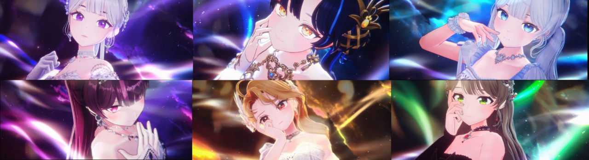
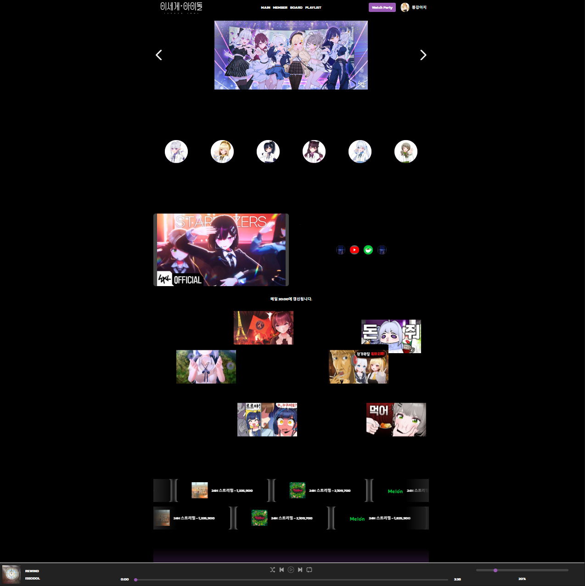
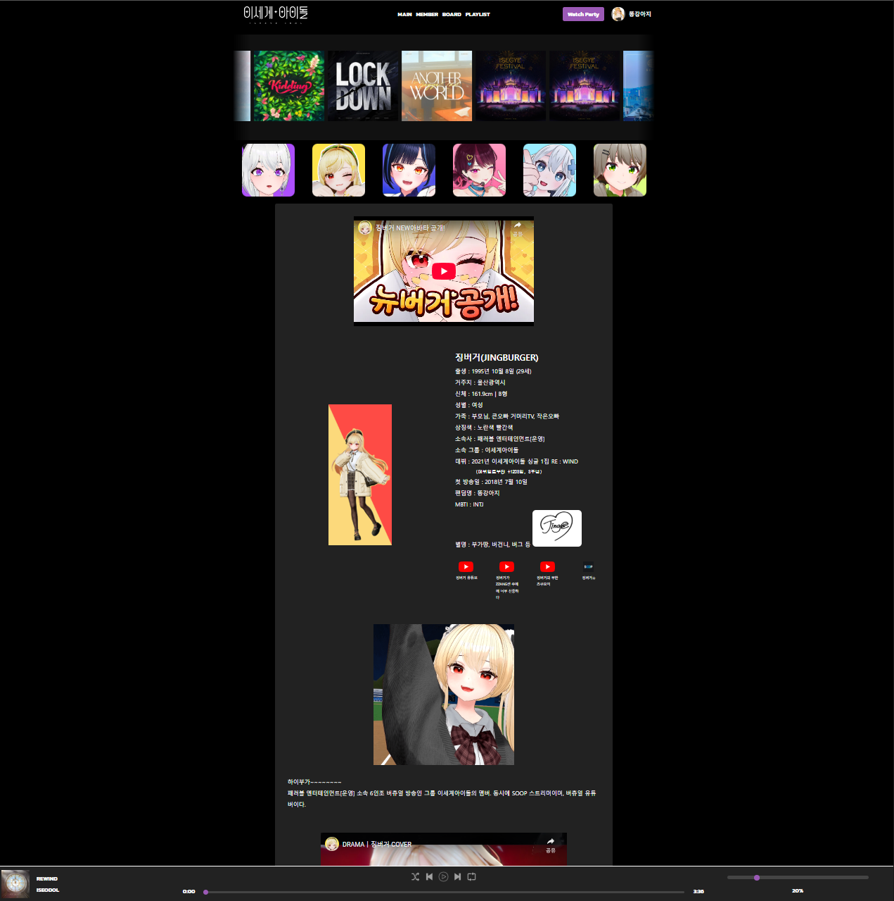
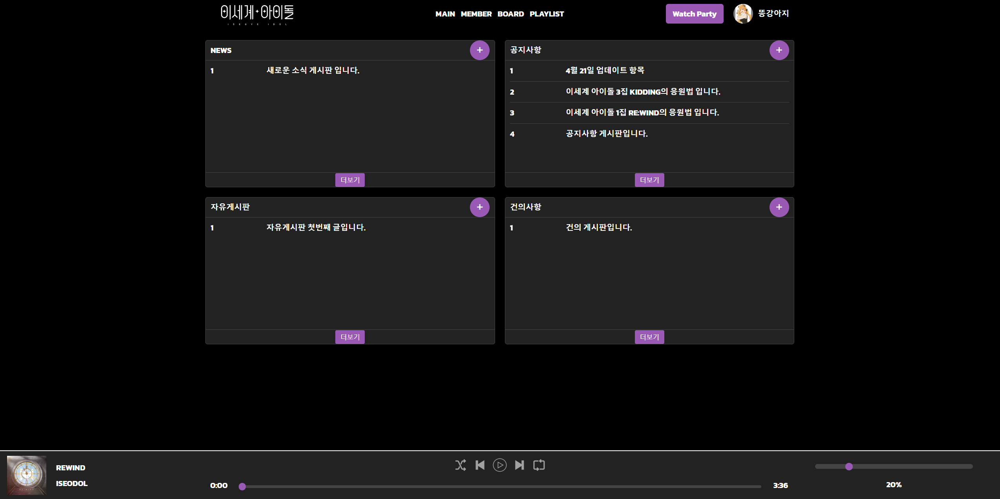
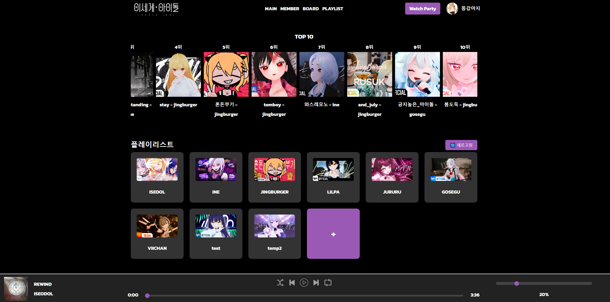
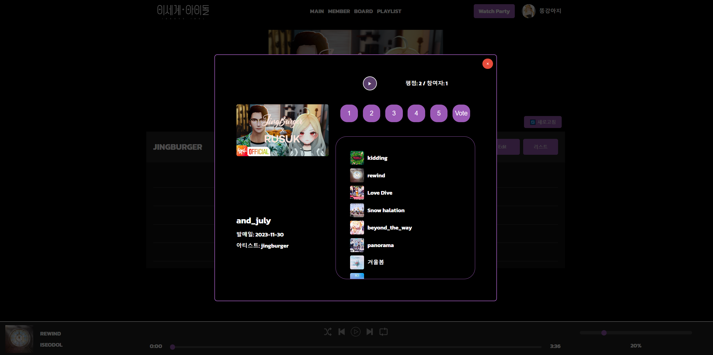
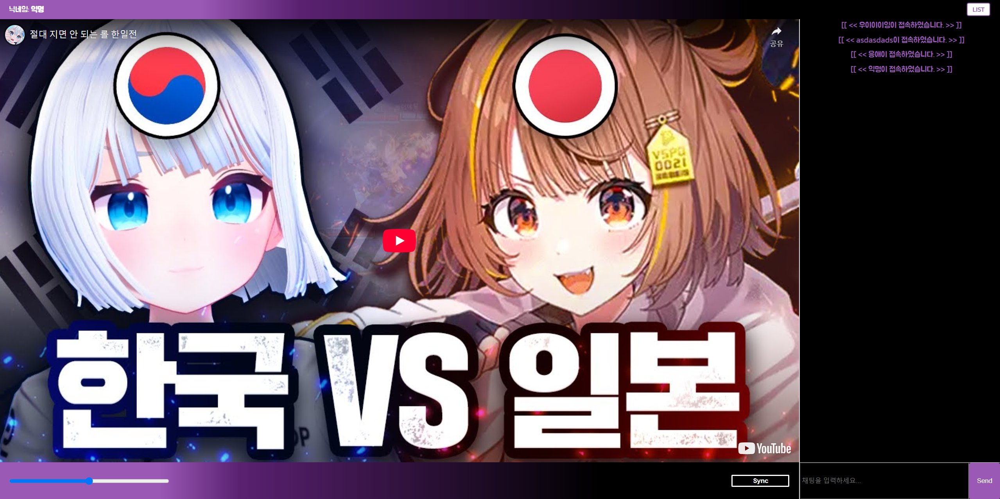

# **IsegyeIDOL Dom_Info <수정중>**
<!--프로젝트 메인 이미지-->

## **<주의> 해당 페이지의 모든 Source는 이세계 아이돌에게 저작권이 있습니다.**
  
<!--목차-->
## 목차
- [**Project**](#project)
    - [Features](#features)
    - [Techniques](#techniques)
    - [Distribution](#distribution)
- [**Page**](#page)
    - [Main Page](#main-page)
    - [Member Page](#member-page)
    - [Board Page](#board-page)
    - [Playlist Page](#playlist-page)
    - [WatchParty Page](#watchparty-page)
- [**Contact**](#contact)

<!--프로젝트 설명-->
## **Project**
- 해당 프로젝트는 인터넷 방송인 그룹 **이세계 아이돌**의 5월 24일 고척돔 공연 축하를 위해 제작되었습니다.
- AI의 사용법 및 적응을 위해 80% 정도 AI를 이용하여 프로젝트를 진행하였으며 주로 GPT와 GROK을 이용하였습니다.
- 해당 프로젝트는 **이세계 아이돌 멤버들의 정보**와 **오리지널 곡 및 커버곡**, 다같이 영상 시청을 위한 **WatchParty**기능이 구현되어 있습니다.

### **Features**
- ServerLess로 개발되어 있으며 Database는 PostgreSQL을 사용하는 Supabase를 이용하였습니다.
- admin페이지를 이용한 데이터 수정, 삭제, 생성이 가능합니다.
- 정보 페이지들은 정보 전달이 주 목적이기 때문에 다양한 interaction이 적용되어 있습니다.
- Playlist페이지는 여러 음악 감상을 위한 기본 Playlist와 자유롭게 Customizing할 수 있도록 작업되어 있습니다.
- WatchParty는 supabase의 realtime을 이용하여 실시간으로 채팅 및 host 여부를 파악할 수 있습니다.

### **Techniques**
- [**HTML5, CSS3, JavaScript**]
-   
- [**Vue.js (3버전)** ]
- 
- [**Supabase**]
- 
- [**Visual Studio Code**]
- 

### **Distribution**
- URL : <a href="http://isedolinfo.dothome.co.kr">이세계 아이돌</a>

<!--각 페이지 설명-->
## **Page**

### **Main Page**

- **Main Page**입니다. 해당 페이지는 초기 로드 화면으로 DB에 등록된 아이디를 통해 접속이 가능합니다.
- 상단의 버튼을 통해 Login과 Sign up을 통해 아이디 등록 및 접속이 가능합니다.

### **Member Page**

- **Member Page**입니다. 상단 멤버 전원의 이미지를 볼 수 있으며 3기 Cliche의 Group music을 들을 수 있습니다.
- SideBar를 통해 정렬 및 검색이 가능하며 이미지 클릭으로 상세 페이지로 이동할 수 있습니다.
- 각 굿즈 정보는 Primary key인 id로 확인 가능합니다.

### **Board page**

- **Board page**입니다. Url의 id값을 통해 각 굿즈의 name, date, production, price를 적용합니다.
- 해당 제품의 상세 정보, 배송, 반품 및 교환에 관한 정보를 얻을 수 있습니다.

### **Playlist Page**

-  **Playlist Page**입니다. Bootstrap을 통해 디자인하였습니다.
- 각 게시판의 정보는 Primary key의 id로 구성되며 password_hash를 이용해 단방향 암호화를 적용하였습니다.

-  **Playlist Datail Page**입니다. Bootstrap을 통해 디자인하였습니다.
- 각 게시판의 정보는 Primary key의 id로 구성되며 password_hash를 이용해 단방향 암호화를 적용하였습니다.

### **WatchParty Page**

-  **WatchParty Page**입니다. Bootstrap을 통해 디자인하였습니다.
- 각 게시판의 정보는 Primary key의 id로 구성되며 password_hash를 이용해 단방향 암호화를 적용하였습니다.

<!--접근-->
## **Contact**
- 📧  **wodnd565@gmail.com**
