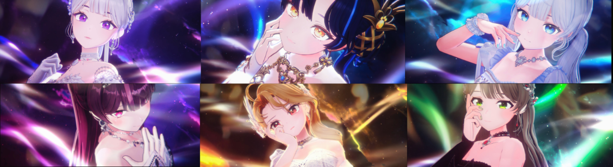
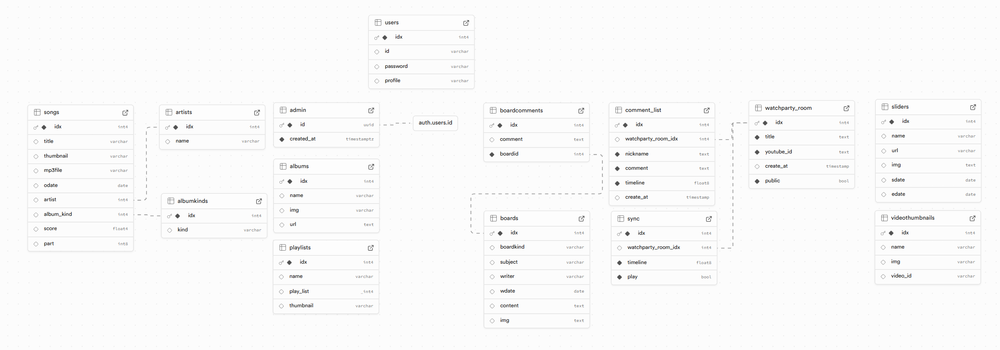
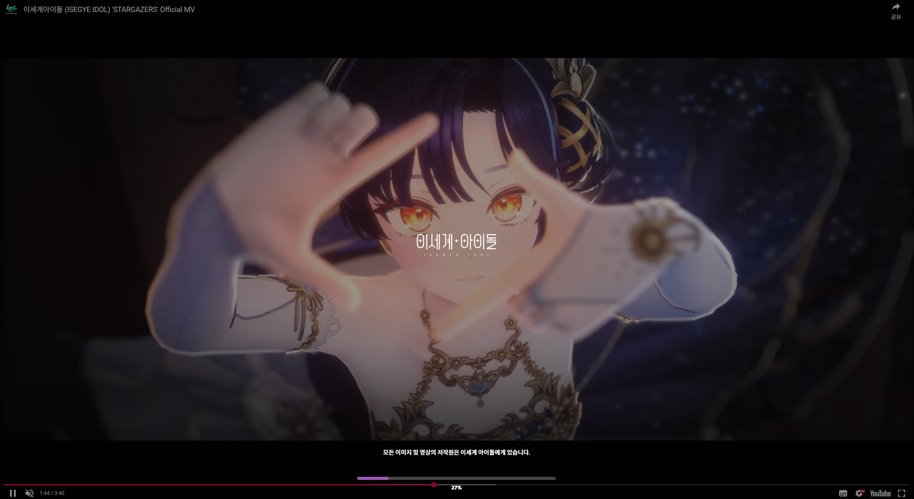
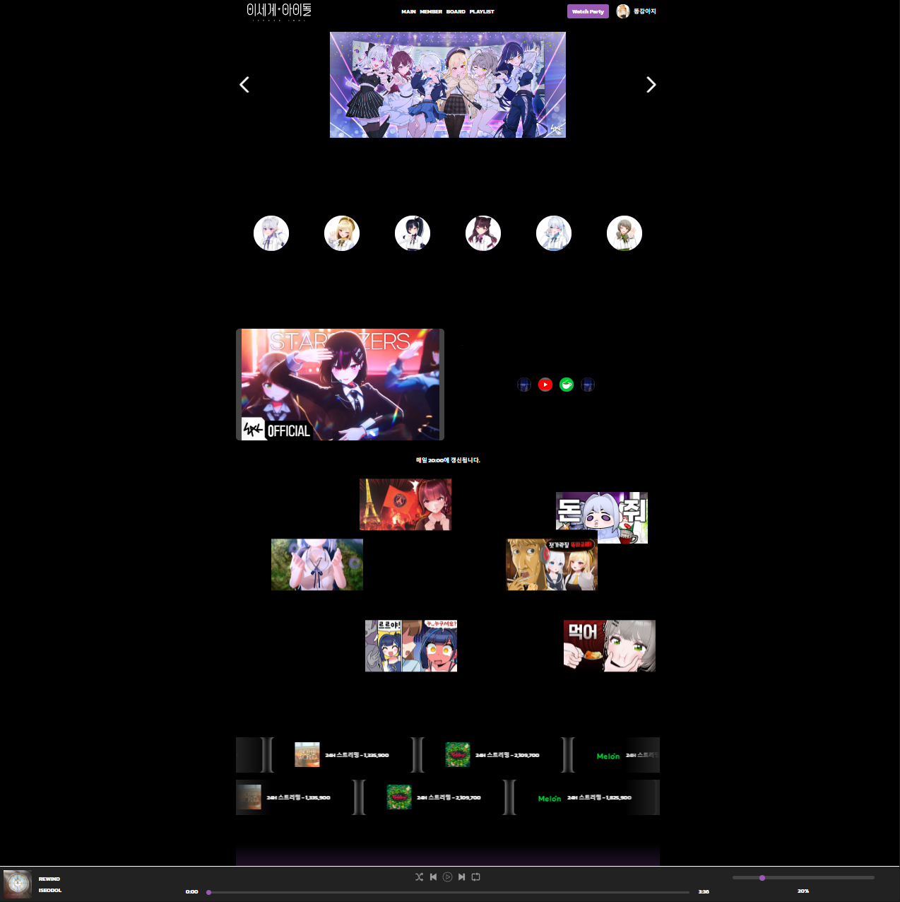
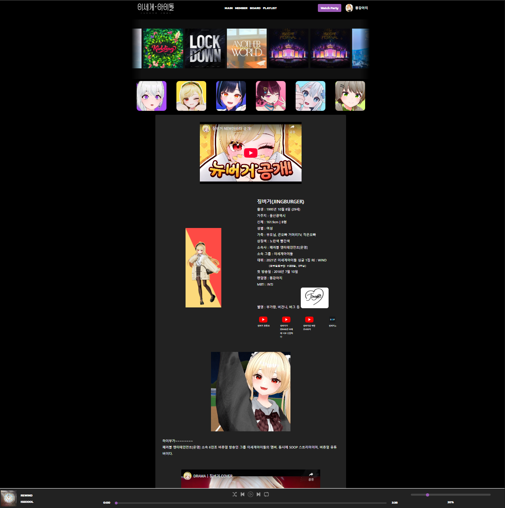
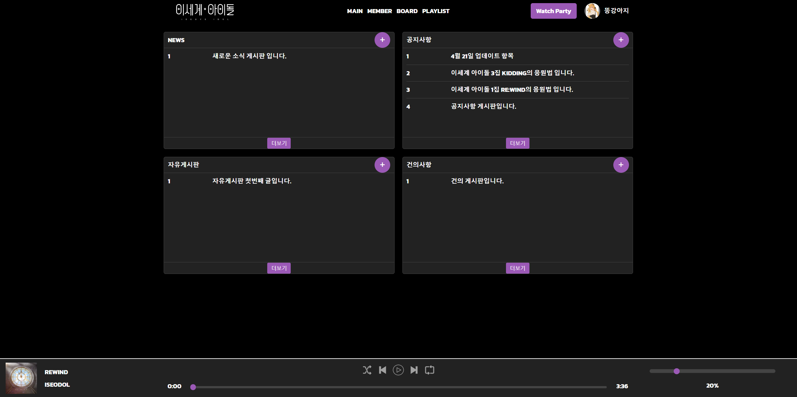
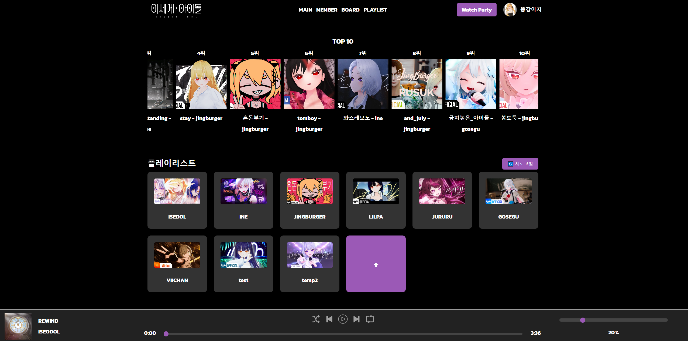
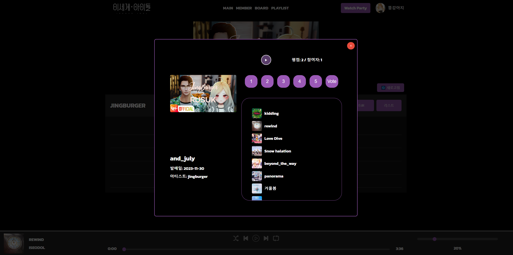
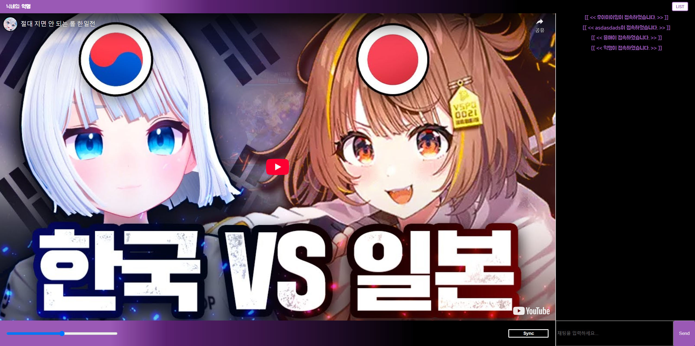
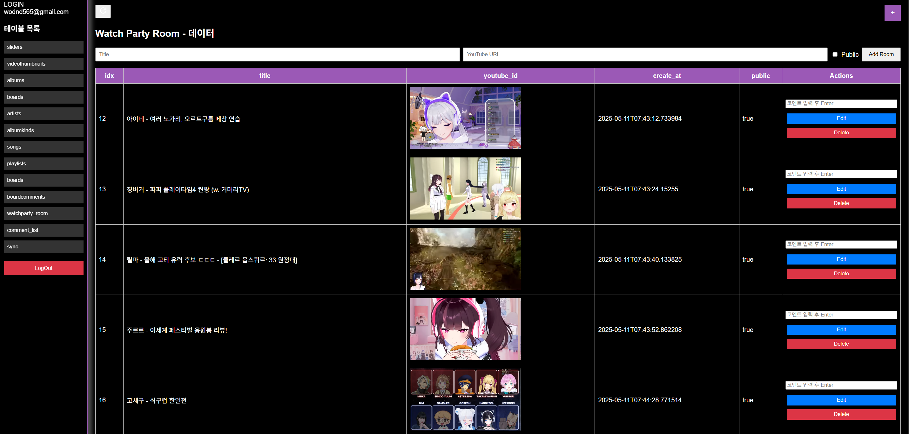

# **ISEGYE IDOL Info**
<!--프로젝트 메인 이미지-->


<hr>

### **<주의> 해당 페이지의 모든 Source는 이세계 아이돌에게 저작권이 있습니다.**
  
<!--목차-->
## 목차
- [**Project**](#project)
    - [Features](#features)
    - [Techniques](#techniques)
    - [Distribution](#distribution)
- [**DB Table**](#db-table)
- [**Page**](#page)
    - [Fixed Element](#fixed-element)
    - [Loading Page](#loading-page)
    - [Main Page](#main-page)
    - [Member Page](#member-page)
    - [Board Page](#board-page)
    - [Playlist Page](#playlist-page)
    - [WatchParty Page](#watchparty-page)
    - [Admin Page](#admin=page)
- [**Contact**](#contact)

<hr>

<!--프로젝트 설명-->
## **Project**
- 해당 프로젝트는 인터넷 방송인 그룹 **이세계 아이돌**의 5월 24일 고척돔 공연 축하를 위해 제작되었습니다.
- AI의 사용법 및 적응을 위해 80% 정도 AI를 이용하여 프로젝트를 진행하였으며 주로 GPT와 GROK을 이용하였습니다.
- 해당 프로젝트는 **이세계 아이돌 멤버들의 정보**와 **오리지널 곡 및 커버곡**, 다같이 영상 시청을 위한 **WatchParty**기능이 구현되어 있습니다.
- SPA로 구현되어 있으며, 태블릿 및 모바일 환경까지 생각하여 반응형 사이트로 제작하였습니다.

### **Features**
- ServerLess로 개발되어 있으며 Database는 PostgreSQL을 사용하는 Supabase를 이용하였습니다.
- admin페이지를 이용한 데이터 수정, 삭제, 생성이 가능합니다.
- 정보 페이지들은 정보 전달이 주 목적이기 때문에 다양한 interaction이 적용되어 있습니다.
- Playlist페이지는 여러 음악 감상을 위한 기본 Playlist와 자유롭게 Customizing할 수 있도록 작업되어 있습니다.
- WatchParty는 supabase의 realtime을 이용하여 실시간으로 채팅 및 host 여부를 파악할 수 있습니다.
- vue3 문법을 이용하여 제작되어있습니다.

### **Techniques**
- [**HTML5, CSS3, JavaScript**]
*   
- [**Vue.js (3버전)** ]
* 
- [**Supabase**]
* 
- [**Visual Studio Code**]
* 

### **Distribution**
- URL : <a href="http://isedolinfo.dothome.co.kr">이세계 아이돌</a>
<hr>

### **DB Table**

- Supabase 연결
```
    const SUPABASE_URL = "https://pdwbghdbrzcaftdzjegw.supabase.co"; // 여기에 네 프로젝트 URL 입력
    const SUPABASE_ANON_KEY ="ANON_KEY"; // 여기에 네 공개 키 입력
    // Supabase 클라이언트 생성
    const supabase = window.supabase.createClient(
      SUPABASE_URL,
      SUPABASE_ANON_KEY
    );
```
- 데이터 가져오기
```
const fetchSliders = async () => {
  const { data, error } = await supabase.from("sliders").select("*");
  if (error) {
    console.error("슬라이더 데이터 로드 에러:", error);
  } else {
    // Supabase에서 가져온 배열 전체를 sliders에 저장
    sliders.value = data;
    // DOM 갱신 후 Swiper 초기화 (v-for로 렌더링 완료 후)
    nextTick(() => {
      new Swiper(".main_banner", {
        autoplay: { delay: 5000, disableOnInteraction: false },
        loop: sliders.value.length > 1, // 슬라이드가 1개 이상일 때만 루프 활성화
        slidesPerView: 1,
        slidesPerGroup: 1,
        navigation: {
          nextEl: ".swiper-button-next",
          prevEl: ".swiper-button-prev",
        },
      });
    });
  }
};
```
<hr>

<!--각 페이지 설명-->
## **Page**
- Page 전환 : DOM 전환 방식을 사용하고 있습니다. DOM 전환과 함께 페이지 요소들을 초기화합니다.
```
const switchPage = (path) => {
  if (path == "page-main") {
    newCp = '/';
  } else {
    newCp = '/' + path.replace('page-', '').replace('-', '/').replace('-', '/');
  }

  if (currentPage.value === path) return;
  currentPage.value = path;
  router.push(newCp);
  nextTick(() => {
    if (path === "page-main") {
      initMainPage();
    } else if (path === "page-member") {
      initMemberPage();
    } else if (path === "page-board") {
      initBoardPage();
    } else if (path === "page-playlist") {
      initPlaylistPage();
    } else if (path.startsWith("page-board-full-")) {
      initFullBoardPage(path);
    } else if (path === "page-playlist-all") {
      fetchSelectedPlaylistSongs();
    }
  });
};
```
- Vue3의 Router 및 MetaData
```
// 라우터 설정 (Vue 3 방식)
const router = createRouter({
  history: createWebHashHistory(),
  routes: [
    { path: '/', component: { template: '<div>Main Page</div>' }, meta: { title: 'Isegye Idol Info Main Page', description: 'You can check information on members, latest songs, latest YouTube videos, and records.' } },
    { path: '/member', component: { template: '<div>Member Page</div>' }, meta: { title: 'Isegye Idol Info Member Page', description: 'This is the album title of each member\'s information and group songs.' } },
    { path: '/board', component: { template: '<div>Board Page</div>' }, meta: { title: 'Isegye Idol Info Board Page', description: 'Check the contents of new information, notice, free bulletin board, and suggestion bulletin board.' } },
    { path: '/board/full/news', component: { template: '<div>Board Full News Page</div>' }, meta: { title: 'Isegye Idol Info Board Full News Page', description: 'Check all the posts on the new information bulletin board.' } },
    { path: '/board/full/notice', component: { template: '<div>Board Full Notice Page</div>' }, meta: { title: 'Isegye Idol Info Board Full Notice Page', description: 'Check all the posts on the notice board.' } },
    { path: '/board/full/free', component: { template: '<div>Board Full Free Page</div>' }, meta: { title: 'Isegye Idol Info Board Full Free Page', description: 'Check all the posts on the free bulletin board.' } },
    { path: '/board/full/suggest', component: { template: '<div>Board Full Suggest Page</div>' }, meta: { title: 'Isegye Idol Info Board Full Suggest Page', description: 'Check all the posts on the suggestion board.' } },
    { path: '/playlist', component: { template: '<div>Playlist Page</div>' }, meta: { title: 'Isegye Idol Info Playlist Page', description: 'Check the top 10 songs and playlist based on user ratings.' } },
    { path: '/playlist/all', component: { template: '<div>Playlist All Page</div>' }, meta: { title: 'Isegye Idol Info Playlist All Page', description: 'You can check, play, and modify the songs in the playlist selected on the playlist page.' } },
  ]
});
// 메타 태그 수동 관리
router.beforeEach((to, from, next) => {
  document.title = to.meta.title || 'Isegye Idol Info';
  const metaDescription = document.querySelector('meta[name="description"]');
  if (metaDescription) {
    metaDescription.setAttribute('content', to.meta.description || 'It is a site to celebrate ISEGYE IDOL\'s performance at Gocheok Dome in May 2025, and to provide information and songs.');
  }
  next();
});
```

<hr>

### **Fixed Element**
> Nav
- 좌측 : 로고
- 중앙 : 페이지 이동
- 우측 : 기본 프로필 및 WatchParty 이동을 위한 button

> Playbar
- 노래 재생을 위한 목적으로 제작되어 있으며 기본 playlist는 **이세계 아이돌**의 단체 오리지널 곡 및 커버곡으로 구성되어있습니다.
- Left : 재생 중인 곡의 기본 정보 [ 앨범커버, 제목, 가수 ]로 구성되어 있습니다.
- Center : 음악 재생 조절을 위한 Progressbar 및 버튼으로 구성되어 있습니다.
> 랜덤재생, 자동재생, 한곡재생, 정지, 실행, 타임라인 이동, 볼륨 조절과 같은 기능들이 구현되어 있습니다.
- Right : 볼룸 조절을 위한 ProgressBar와 수치 표시로 구성되어 있습니다.

<hr>

### **Loading Page**

- **Loading Page**입니다. 해당 페이지는 페이지 접근 직후 출력되는 페이지 입니다.
- ProgressBar를 통한 접속 대기 시간을 제공합니다.

<hr>

### **Main Page**

- **Main Page**입니다. 해당 페이지는 로딩페이지에서 로드 직후 출력되는 페이지 입니다.
> 섹션 단위
- 1 section : 상단 배너로 이는 상업적으로 이용할 경우 광고를 출력하기 위한 공간입니다.
- 2 section : 각 멤버들의 정보를 간략하게 출력합니다.
- 3 section : 최신곡을 기준으로 title, youtube url, naver cafe, 가사 일부 를 출력합니다.
- 4 section
> 각 멤버들의 최신 영상을 출력하며 이는 매일 오후 8시마다 갱신됩니다. <br>
> 클릭하면 해당 섹션을 전체로 영상이 출력됩니다. <br>
> 영상 클릭 후 닫으면 카드의 위치가 랜덤하게 변경됩니다. <br>
- 5 section : reward를 무한 슬라이더로 정의해 놓았습니다.
- Footer : Git주소 및 Email 주소가 작성되어 있습니다.

<hr>

### **Member Page**

- **Member Page**입니다. **이세계 아이돌의 앨범아트** 및 **이세계 아이돌 멤버의 상세 정보**를 출력합니다.
- 정보는 JavaScript에 저장되어 있으며 멤버 별 이미지를 클릭하는 경우 하단 정보가 변경됩니다.

<hr>

### **Board page**

- **Board page**입니다. 각 News, 공지사항, 자유게시판, 건의사항 으로 구성되어 있습니다.
> Type
- News : 새로운 정보를 교환하는 게시판입니다.
- 공지사항 : 수정 내역 및 공지를 위한 게시판입니다.
- 자유게시판 : 이용자들의 의견을 교환하기 위한 게시판입니다.
- 건의사항 : 이용자들이 이용 중 건의사항을 제보하기 위한 게시판입니다

<hr>

### **Playlist Page**

-  **Playlist Page**입니다. 이용자의 투표를 통해 높은 점수를 가진 음악 top 10을 무한슬라이드로 출력됩니다.
-  기본 플레이리스트 및 추가적으로 플레이 리스트를 생성할 수 있습니다.

- 무한슬라이더 : 각 슬라이드의 크기를 계산하여 끝나는 경우 슬라이드의 마지막 위치에 생성되도록 하였습니다.
```
function initTopSlider() {
  nextTick(() => {
    const cards = topCards.value;
    if (!cards.length === 0) return;
    const cardWidth = cards[0].offsetWidth + 10;
    cards.forEach((el, i) => {
      topPositions.value[i] = i * cardWidth;
      el.style.position = 'absolute';
      el.style.transform = `translateX(${topPositions.value[i]}px)`;
    });

    const additionalOffsetFactor = window.innerWidth <= 768 ? 856 : 160;

    function animate() {
      if (!isTopPaused.value) {
        for (let i = 0; i < cards.length; i++) {
          topPositions.value[i] -= topSpeed;
          if (topPositions.value[i] <= -cardWidth * (cards.length/2)) {
            topPositions.value[i] += cardWidth * (cards.length/2) + window.innerWidth + additionalOffsetFactor;
          }
          cards[i].style.transform = `translateX(${topPositions.value[i]}px)`;
        }
      }
      requestAnimationFrame(animate);
    }
    animate();
  });
}
```


-  **Playlist Datail Page**입니다. 해당 플레이리스트의 수정 및 삭제가 가능합니다.
-  해당 노래를 클릭하여 해당 단일 곡 재생 및 투표, 점수를 확인할 수 있습니다.

<hr>

### **WatchParty Page**

-  **WatchParty Page**입니다. 해당 페이지는 사용자가 같이 공유 및 채팅을 진행하면서 영상 공유를 원할 경우 같이 보기 위한 페이지입니다.
-  Supabase의 realtime기능을 이용하여 실시간으로 동기화 되도록 처리하였습니다. 
-  영상은 유튜브의 영상이 기준이며 host가 영상을 재생한 후 sync버튼을 통해 시청자는 영상을 시청할 수 있습니다.

- Chatting의 기능은 Supabase의 realtime을 이용하였습니다.
> 아래 코드는 realtime을 구독하여 WebSocket과 동일하게 양방향 통신으로 데이터를 수정 및 가져오는 방법입니다.
```
function subscribeToChat() {
  if (chatSubscription) chatSubscription.unsubscribe(); // Unsubscribe from previous subscription
  chatSubscription = supabase
    .channel('chat-' + roomId)
    .on(
      'postgres_changes',
      { event: 'INSERT', schema: 'public', table: 'comment_list', filter: `watchparty_room_idx=eq.${roomId}` },
      (payload) => {
        const c = payload.new;
        const key = `${c.nickname}-${c.timeline}-${c.comment}`;
        if (!shownComments.has(key)) {
          shownComments.add(key);
          const p = document.createElement('p');
          if (c.nickname === "host") {
            p.classList.add('host');
            p.textContent = `[[ ${c.comment} ]]`; // 호스트 메시지 포맷 수정
          } else {
            p.textContent = `[${formatTime(c.timeline)}] ${c.nickname}: ${c.comment}`;
          }
          chatLog.appendChild(p);
          chatLog.scrollTop = chatLog.scrollHeight;
        }
      }
    )
    .subscribe();
}
```

- Host가 재생하는 영상과 시청자가 보든 영상의 Sync는 다음과 같이 동작합니다.
> Host가 admin페이지에서 영상을 재생 및 조작합니다. 이를 DB에 저장합니다. <br>
> 시청자의 경우 재생 여부 및 재생 타임라인을 DB에서 가져와 처음 접속 시 Sync버튼을 통해 영상 재생을 시작합니다. <br>
> 이는 2초마다 DB의 저장된 TimeLine과 영상의 TimeLine을 비교하여 2초 이상 차이가 날 때 자동으로 수정합니다. <br>
```
function startSyncPolling() {
  if (syncCount < 1) return;
  if (syncInterval) clearInterval(syncInterval);
  syncInterval = setInterval(async () => {
    const { data } = await supabase.from('sync').select('timeline, play').eq('watchparty_room_idx', roomId).single();
    if (player && typeof player.getCurrentTime === 'function' && data) {
      const current = player.getCurrentTime();
      if (Math.abs(current - data.timeline) > 2 || !data.play) {
        player.seekTo(data.timeline, true);
        if (data.play) {
          player.playVideo();
        } else {
          player.pauseVideo();
        }
      }
    }
  }, 2000);
}
```

<hr>

### **Admon Page**

- **Admon Page**입니다. 해당 페이지는 Admin 유저가 데이터의 정기적 갱신 및 수정, 삭제와 같은 CRUD를 진행하기 위해 제작된 페이지입니다.
- 데이터의 정제가 주 목적이기 때문에 간단한 디자인으로 구성되어 있습니다.
- 영상 공유 또한 Admin 유저만 가능하며 재생 여부 및 삭제, host message의 동작이 가능합니다.
- 해당 페이지는 로그인을 통해 접근이 가능합니다.
- 로그인 인증처리 : Supabase의 auth테이블을 이용해 인증처리가 진행됩니다.
```
/* ------ 인증 관련 메서드 ------ */
async loginUser() {
  if (!this.loginId || !this.loginPw) {
    alert("아이디와 비밀번호를 모두 입력하세요.");
    return;
  }
  const { data, error } =
    await supabaseClient.auth.signInWithPassword({
      email: this.loginId,
      password: this.loginPw,
    });
  if (error) {
    alert("로그인 실패: " + error.message);
  } else {
    console.log(
      "로그인 성공. Access Token:",
      data.session.access_token
    );
    this.userEmail = data.user.email;
    this.isLoggedIn = true; // 로그인 상태로 설정
    this.currentView = "list";
    this.selectTable(this.tables[0]);
  }
}
```

<hr>

<!--접근-->
## **Contact**
- 📧  **wodnd565@gmail.com**
